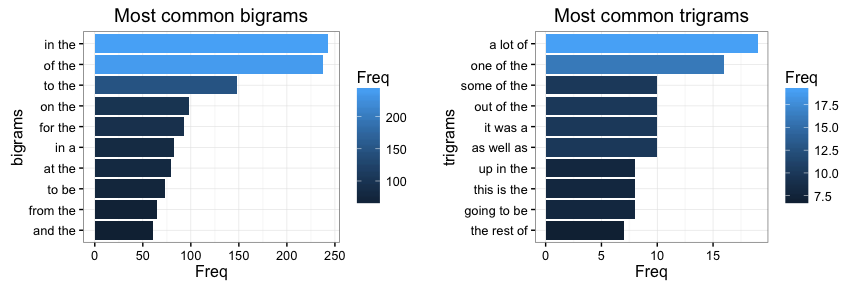
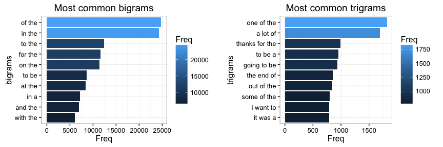
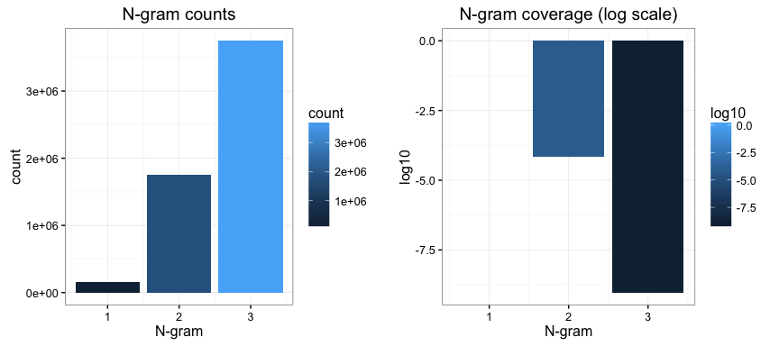
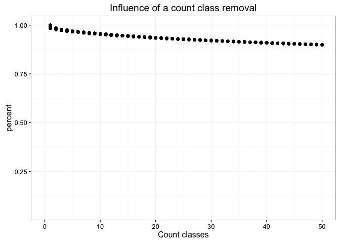

# Exploratory data analysis
Alexandre Nanchen  
01 June 2016  

# Synopsis
Around the world, people are spending an increasing amount of time on their mobile devices for email,
social networking, banking and a whole range of other activities. But typing on mobile devices can be
a serious pain. 

The goal of the project is to build a predictive algorithm that help users by suggesting words as they are
typing.

# Data description
The data is made available from the course web site. Here is a summary of the downloaded english US
text.

### Data statistics

DataSet    Number.lines   Number.words
--------  -------------  -------------
Twitter       2'360'148     30'374'206
News            899'288     37'334'690
Blogs         1'010'242     34'372'720

In total, **4'269'678** sentences and **102'081'616** words.

### Data selection
The purpose of the data selection is to choose a representative subset from the 100 Mio words. This step is necessary
because the final models will be running on a Web Server with limited memory and disk space.

A divide and conquer method associated with random sampling has been chosen:

1. Select all sentences having more than 3 words and less than 50 words
2. Choose the amount of sentences per source (twitter, blogs and news) you want to keep
3. Sample randomly the chosen amount of sentences from the three sources making sure that
   there is an equal proportion of sentences per sentence words length

In total, **299'934** lines **5'941'264** words.

# Data preparation
Before modeling the language, some data transformations have been applied to the sampled data.

##### Special characters replacements:
   - Emoticons
   - Control characters
   - Special utf-8 characters
   
##### Text normalization:
   - Lowercasing
   - Numbers removal
   - Punctuation removal
   - White space normalization,
   - Offensive words removal

# Exploratory data analysis

The exploratory data analysis will be performed on the sampled data containing **299'437** sentences.

### N gram frequencies
#### Unigrams

In total, there are **158'771** unique words.

Here is a words cloud of words occurring more than 50 times.
<!-- -->

#### Bigrams and trigram counts
Here are some plots of bigram and trigram counts.

<!-- -->

It is apparent that when changing N-gram order, i.e. from bigram to trigram, the number of observed counts decrease substantively.

### N-gram coverage
By coverage we mean the percentage of observed N-grams (from the text sentences) versus all possible N-grams for a
given N-gram order (2-grams, 3-grams, ...).

For example if the selected vocabulary is 5 unique words, the maximum number of bigram is 5*5 = 25. Then we can compare
this number with the observed bigrams. Suppose we observe 5 unique bigrams, then the bigram coverage is 5 for 25 or 20%.

Now lets check the N-gram coverage of the sampled text.

<!-- -->

The left plot display the observed counts per N-gram order (1,2,3-grams). The right plot shows the coverage of
the observed N-grams.

For the unigram, as we don't know all possible words for the english language, there is no coverage.
However, for bigrams and trigrams we see a coverage lower than 0.001% and 0.00000001% respectively.

This underline the fact that relying only on 3 grams will not work. We will have to use lower order N-grams as well
has higher order N-grams to do our word prediction.

### Word selection
We have seen that the number of unigrams play an important role in the N-gram coverage. The more vocabulary, the
less N-gram coverage there will be.

Ideally we would like to reduce the number of unigrams while keeping the maximum information contained in the observed text sentences.

One way to check how many vocabulary words are necessary is to plot classes of N-gram counts (N-grams with count 1,2,...,50,...) 
versus their contribution towards the total word occurrences.

<!-- -->

On the plot we can see that the removal of words appearing only once will keep the word coverage above 90%.

### Conclusion and futur plans
The first important conclusion is that bigram and trigram coverages are very low. It is indeed very difficult to observe all
bigrams and trigrams combinations: we need a lot of text. So a strategy is to combine multiple models of different orders.
For exampling backing of to lower order models.

The second observation is that we can eliminate some keywords appearing rarely while keeping most of the information
contained in the observed text. Reducing the number of keywords will help to have a model of reasonable size with a
good predictive quality.

Hence, the next steps are to select a list of vocabulary words and build a back-off model for 3,2,1 grams projected
on the selected vocabulary.
