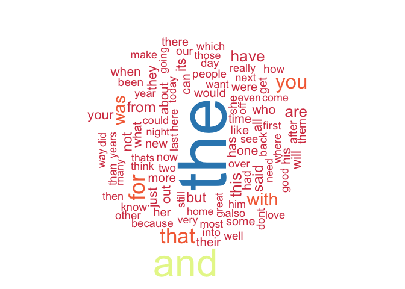

# Exploratory data analysis
Alexandre Nanchen  
23 April 2016  


# Synopsis


# Data selection
First the data is downloaded from the course web site and unziped.
The current document will be focused on the **en_US** texts.

Some of the scripts are too long to be show. You can find them on my 
[Capstone git repository](https://github.com/alexnanchen/datascience-capstone-project.git)

### Dataset statistics

DataSet    Number.lines   Number.words
--------  -------------  -------------
Twitter       2'360'148     30'374'206
News          1'010'242     34'372'720
Blogs           899'288     37'334'690

In total, **4'269'678** lines **102'081'616** words.

### Data sampling
The purpose of the data sampling is to select a representative subset of the 100 Mio words trying to avoid a potential
bias.

A divide and conquer method associated with random sampling has been chosen:

1. Load all sentences having more than 3 words and less than 50 words.
1. Choose the total amount of lines for the subset, in our case 1.5 Mio (500'000 per source)
2. Subsample sentences from the available sources: twitter, blogs and news using the following algorithm:
    - For the given data source, compute sentence words length density
    - Use this density to randomly select the appropriate amount of sentences for each class

The script use to do the sampling is called *datasampling.R*.

In total, **1'499'935** lines **31'213'036** words.

# Data preparation
The data preparation has been performed with the *datapreparation.R* script.

The following transformations have been applied to the data sample:

#### Special characters replacements
Emoticons, control characters, special utf-8 characters
```
#Emoticons replacement
strText <- mapUtf8Characters(strText, EMOTICONSMAP)

#Control characters replacement
strText <- mapUtf8Characters(strText, CONTROLMAP)

#Utf-8 characters replacement
strText <- mapUtf8Characters(strText, UTF8MAP)
```

#### Text normalization
Lowercasing, numbers removal,punctuation removal, white space normalization, offensive words removal
```
c <- VCorpus(VectorSource(strText))
c <- tm_map(c, tolower)
c <- tm_map(c, removeNumbers)
c <- tm_map(c, removePunctuation)
c <- tm_map(c, stripWhitespace)
c <- tm_map(c, PlainTextDocument)
c <- tm_map(c, removeWords, offensiveWords)
```

# Exploratory data analysis

The exploratory data analysis will be performed on **2'928** sentences.

### N gram frequencies
http://edutechwiki.unige.ch/fr/Tutoriel_tm_text_mining_package

#### Unigrams
Here is a word cloud of words occurring more than 50 times.
<!-- -->

#### Bigrams - trigrams - 4-grams

```
## [1] 53313
```

### Word selection

### Foreign words


